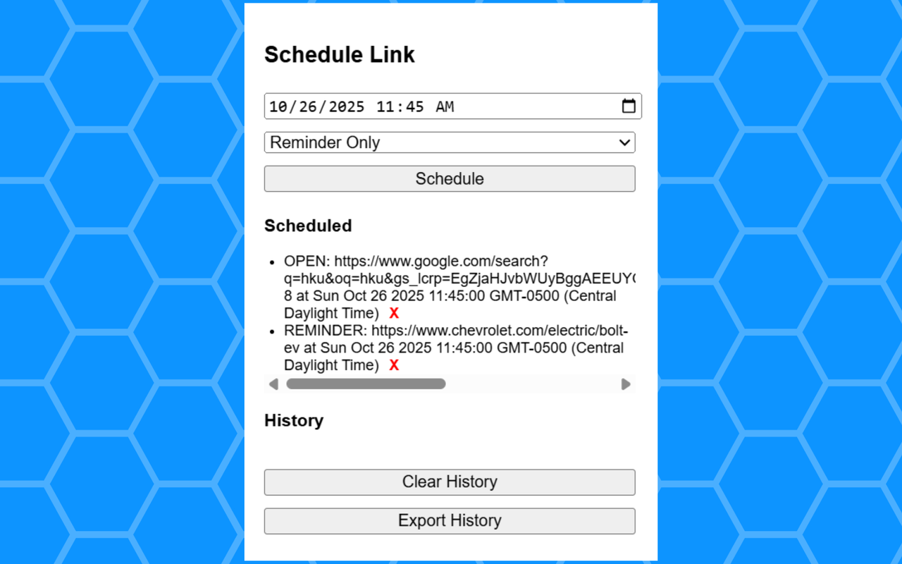
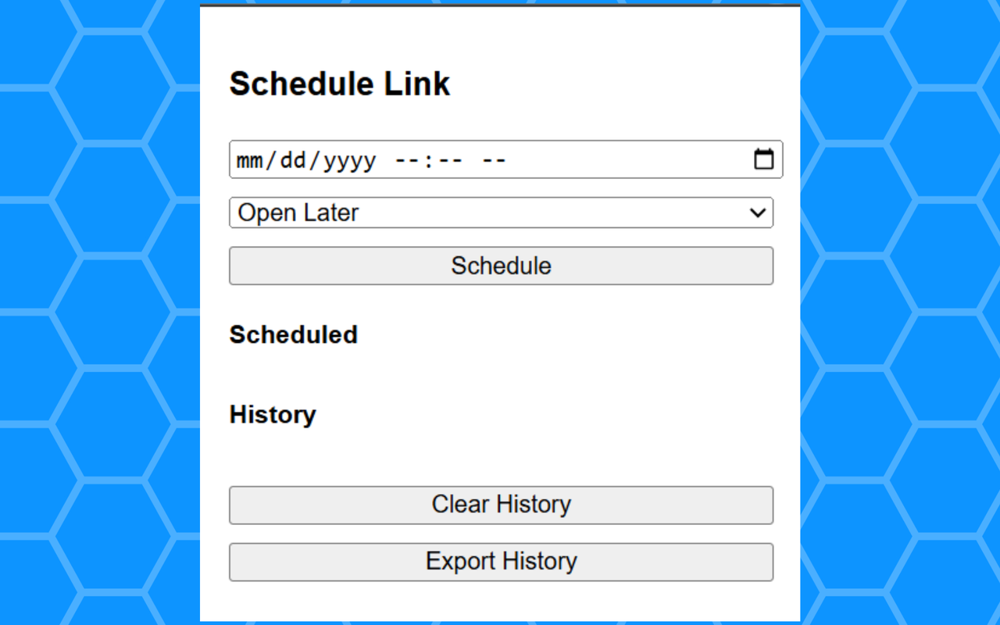
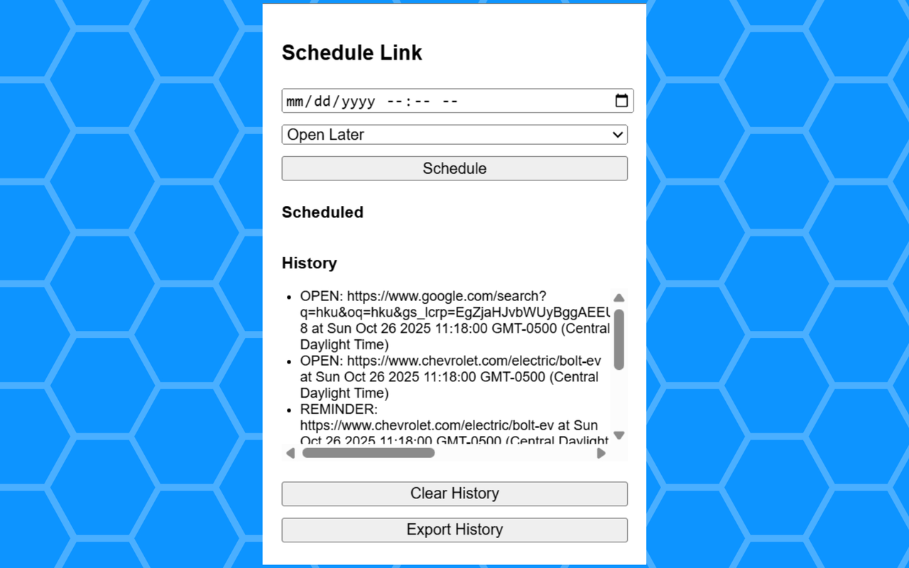

# Link Scheduler
Schedule any number of links to reopen later. Alternatively, you can send yourself a push notification of the link in the future.

You can delete upcoming actions as well as export your history.

Made by Keshav Santhanam
https://keshavsanthanam.github.io/

## Images
- Some Scheduled Actions

- Blank Default Page

- Some History Items

